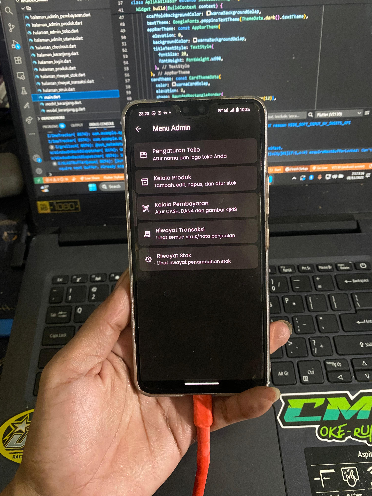
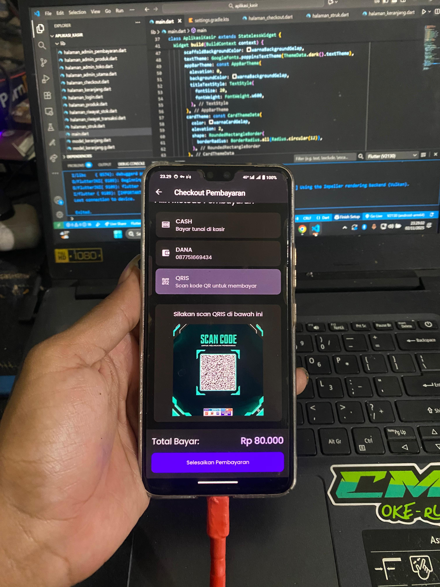
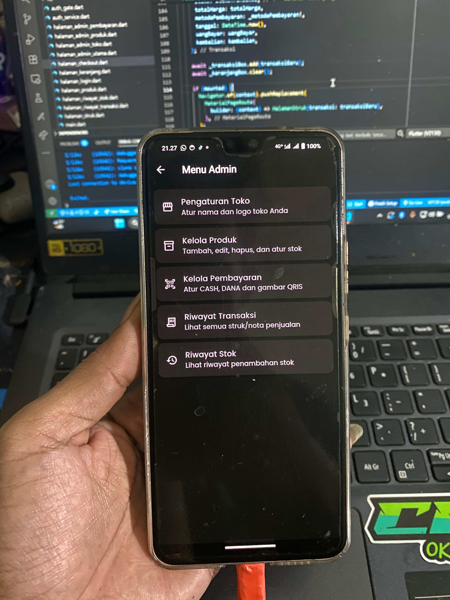

# 💰 Aplikasi Kasir Flutter

Aplikasi Kasir sederhana berbasis **Flutter** yang digunakan untuk mengelola transaksi penjualan, stok produk, dan metode pembayaran (CASH, DANA, QRIS).  
Aplikasi ini cocok digunakan untuk toko kecil, kafe, atau usaha retail yang membutuhkan sistem kasir digital sederhana namun fungsional.

---

## 🚀 Fitur Utama

- 🔐 **Login Admin**
- 🛍️ **Kelola Produk**
  - Tambah, edit, hapus, dan atur stok produk.
- 💸 **Kelola Pembayaran**
  - Pilihan metode pembayaran: CASH, DANA, dan QRIS.
- 📦 **Riwayat Stok**
  - Menampilkan histori penambahan stok barang.
- 🧾 **Riwayat Transaksi**
  - Melihat struk/nota dari setiap penjualan yang dilakukan.
- ⚙️ **Pengaturan Toko**
  - Ubah nama toko dan logo sesuai kebutuhan.

---

## 🧠 Teknologi yang Digunakan

- **Flutter** (Front-end Framework)  
- **Dart** (Bahasa Pemrograman)  
- **Firebase / SQLite** (opsional, tergantung implementasi penyimpanan)  
- **State Management:** `setState`, Provider, atau GetX (sesuaikan dengan proyekmu)  
- **UI Library:** Material Design

---

## 📱 Tampilan Aplikasi

Berikut beberapa tampilan hasil aplikasi kasir ini (pastikan file gambar berada di root repo atau path yang sesuai):

### 🛒 Halaman Produk  
Menampilkan daftar produk yang tersedia beserta stok dan harga.  

---

### ⚙️ Menu Admin  
Berisi pengaturan toko, kelola produk, pembayaran, dan riwayat transaksi.  

---

### 💳 Halaman Checkout Pembayaran  
Pilih metode pembayaran (Cash, DANA, QRIS) dan selesaikan transaksi.  

---

### 🧾 Riwayat Stok dan Transaksi  
Menampilkan histori stok dan penjualan.  

---

## 🧩 Struktur Folder (contoh)

lib/

├── halaman_admin_pembayaran.dart

├── halaman_admin_produk.dart

├── halaman_admin_stok.dart

├── halaman_admin_transaksi.dart

├── halaman_checkout.dart

├── halaman_login.dart

├── halaman_keranjang.dart

├── main.dart

├── auth_gate.dart

└── settings.gradle

## ⚡ Cara Menjalankan

1. Clone repositori ini:
2. Masuk ke folder project:
cd aplikasi_kasir
3. Jalankan perintah untuk mendapatkan dependency:
flutter pub get
4. Jalankan aplikasi:
flutter run

🧑‍💻 Login
(contoh):

Email: admin@kasir.com  
Password: 123456

## 🎬 Have Fun Video Aplikasi

[![Tonton]](https://youtube.com/shorts/3hs6lkar5I0?si=K_cnogpBPYmBjPzk)

📸 Preview Project

Dibuat dan diuji langsung di perangkat Android menggunakan koneksi debug melalui VS Code.
